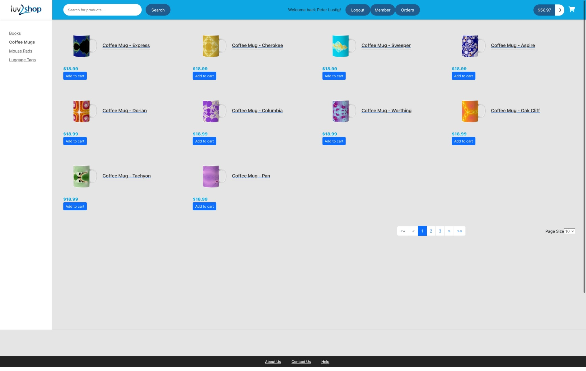

# Full-stack e-commerce demo website built with Angular, Spring Boot and MariaDB

This project was created within the course [Full Stack: Angular and Java Spring Boot E-Commmerce Website](https://www.udemy.com/course/full-stack-angular-spring-boot-tutorial/) on Udemy.

It is built using Spring Boot 3.1 and MariaDB as backend/database, using Spring Data Rest among other. The frontend is built using Angular 14 and Bootstrap 5. [Okta](https://www.okta.com) is used for authentication and authorization. [Stripe](https://stripe.com/) is used for payment processing.

## Setup

### Backend/Spring Boot

1. Install [MariaDB](https://mariadb.org/download/) and set it up using the SQL files in [Starter Files](.starter-files/). Configure the database properties in [application.properties](springboot-ecommerce/src/main/resources/application.properties.example).
2. Create an [Okta](https://developer.okta.com/) account and set up an application. Configure the Okta properties in [application.properties](springboot-ecommerce/src/main/resources/application.properties.example).
3. Create a [Stripe](https://stripe.com/) account and set up an application. Configure the Stripe properties in [application.properties](springboot-ecommerce/src/main/resources/application.properties.example).
4. Create SSL certificates using e.g. [this guide](https://www.thomasvitale.com/https-spring-boot-ssl-certificate/). (A self-signed certificate was used for demo purposes.) Configure the SSL properties in [application.properties](springboot-ecommerce/src/main/resources/application.properties.example).
5. Delete the .example suffix from application properties. un the backend using `mvn spring-boot:run` in the [backend](springboot-ecommerce/) directory.

### Frontend/Angular

1. Configure the API URL in [environment.ts](angular-ecommerce/src/environments/environment.ts.example).
2. Configure your Okta id and url in [my-app-config.config.ts](angular-ecommerce/src/app/config/my-app-config.ts.example) and delete the .example suffix.
3. Configure your Stripe public key in [checkout.component.ts](angular-ecommerce/src/environments/environment.ts.example) and delete the .example suffix.
4. Generate SSL certificates using e.g. [this guide](https://github.com/darbyluv2code/fullstack-angular-and-springboot/blob/master/bonus-content/secure-https-communication/openssl-setup.md. (A self-signed certificate was used for demo purposes.)
5. Run `npm install` in the [frontend](angular-ecommerce/) directory.
6. To run with HTTPS, use `npm start` in the same directory. To run with HTTP, use `ng serve`.
